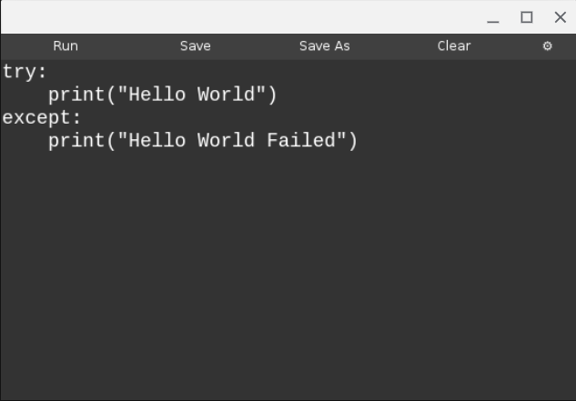

# Scripty
An Open-Source IDE for ChromeOS by Jaden Arceneaux

# Usage:

  python3 scripty.py [file name]
  
  
  
  
  
  

# Requirements:

  - Python3(and its built-in moduals)
  
  - Tkinter
  
  - Tinux
  
  - Java
  
  - C++
